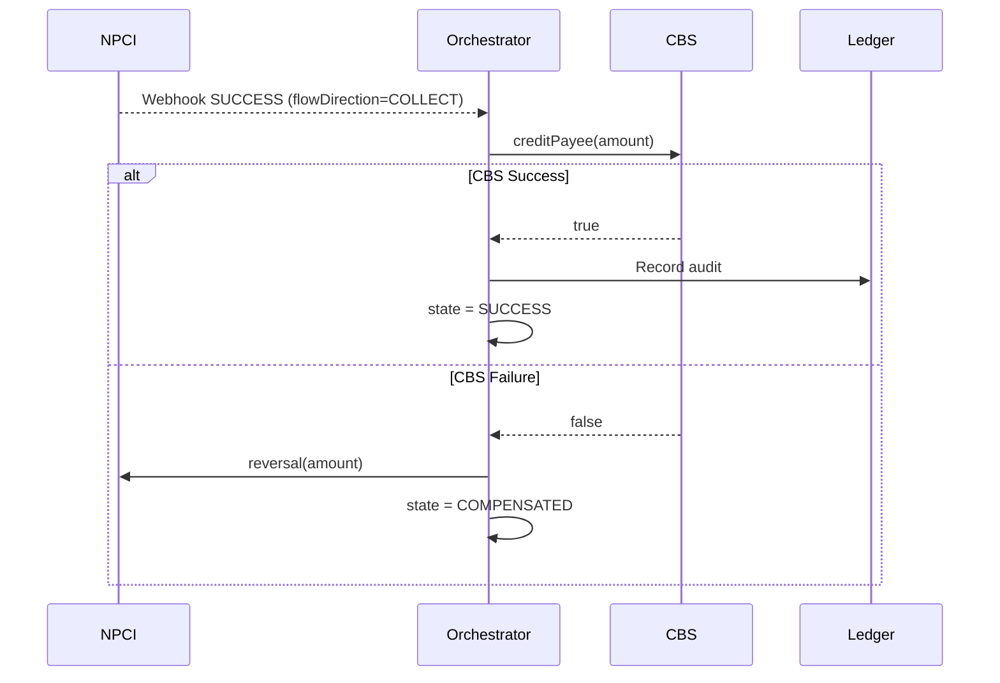

# COLLECT Flow (Receiver-Side) Tests

The **COLLECT flow** is triggered when a Merchant's PSP (our Orchestrator) receives confirmation from NPCI that a customer has been debited. Unlike SEND, our PSP must now **credit the merchant's account in the local CBS** (Core Banking System). If CBS fails, we **compensate by reversing the NPCI debit** so the customer isn't charged unfairly.



---

## test13 — COLLECT Happy Path

**What it proves:** When NPCI webhook arrives for a `COLLECT` transaction and the CBS successfully credits the merchant, the full Saga completes to `SUCCESS` and the audit is written.

```java
req.put("flowDirection", "COLLECT");  // <-- key field

MvcResult result = mockMvc.perform(post("/api/v1/txn").content(req))
    .andExpect(status().isAccepted())
    .andExpect(jsonPath("$.flowDirection").value("COLLECT"))  // echoed back
    .andReturn();

awaitState(txnId, "SUCCESS");
assertTrue(ledgerService.hasEntry(txnId));  // Merchant account credited + ledger written
```

**Log trace for this test:**
```
[NPCI_ADAPTER]  REST_CALL_SENT    | awaiting webhook
[WEBHOOK]       NPCI_SUCCESS      | responseCode=00 | approvalRefNo=ARN-XXXXXX
[CBS_ADAPTER]   REST_CALL_SENT    | payee=merchant@yesbank | amount=...
[CBS_ADAPTER]   CREDIT_SUCCESS    | payee credited
[LEDGER]        RECORDED          | approvalRefNo=ARN-XXXXXX
[STATE]         UPDATED           | state=SUCCESS
```

---

## test05 — COLLECT + CBS Failure → COMPENSATED

**What it proves:** This is the most critical enterprise scenario. NPCI has already debited the customer's account. Our CBS goes down and fails to credit the merchant. Without compensation, the customer would lose money permanently. The Saga **automatically reverses the NPCI debit** and locks the state to `COMPENSATED`.

```java
cbsAdapter.setFailureMode(true);   // Simulate CBS outage
req.put("flowDirection", "COLLECT");

awaitState(txnId, "COMPENSATED");  // Saga auto-compensated
assertFalse(ledgerService.hasEntry(txnId));  // No ledger write — money fully reversed
```

**Full real-world log trace observed in live testing:**

```
[NPCI_ADAPTER]  REST_CALL_SENT       | state=SUBMITTED
[WEBHOOK]       NPCI_SUCCESS         | responseCode=00 | approvalRefNo=ARN-896860
[CBS_ADAPTER]   REST_CALL_SENT       | payee=merchant@yesbank | amount=800.00
[CBS_ADAPTER]   CREDIT_REJECTED      | failureMode=true
[CBS_ADAPTER]   CREDIT_FAILED        | Triggering compensation
[COMPENSATION]  REVERSAL_SENT        | amount=800.00
[NPCI_ADAPTER]  REVERSAL_COMPLETED   | amount=800.00
[STATE]         UPDATED              | state=COMPENSATED
[IDEMPOTENCY]   RESPONSE_CACHED      | state=COMPENSATED
[NOTIFY]        state=COMPENSATED    | Reversal initiated
```

---

## Why `COMPENSATED` and not `FAILED`?

| State | Meaning |
|-------|---------|
| `FAILED` | NPCI rejected — the customer was **never charged** |
| `COMPENSATED` | NPCI succeeded but CBS failed — the customer **was charged and then reversed** |

These two states are fundamentally different and require different reconciliation processes. `COMPENSATED` transactions trigger a dispute workflow with NPCI to verify the reversal was applied.

---

## The CBS Toggle for Live Demo


```bash
# Simulate CBS outage
POST http://localhost:8081/api/v1/control/cbs-failure?enabled=true

# Restore CBS
POST http://localhost:8081/api/v1/control/cbs-failure?enabled=false
```

This demonstrates operational control, a key production readiness requirement for FinTech systems.
