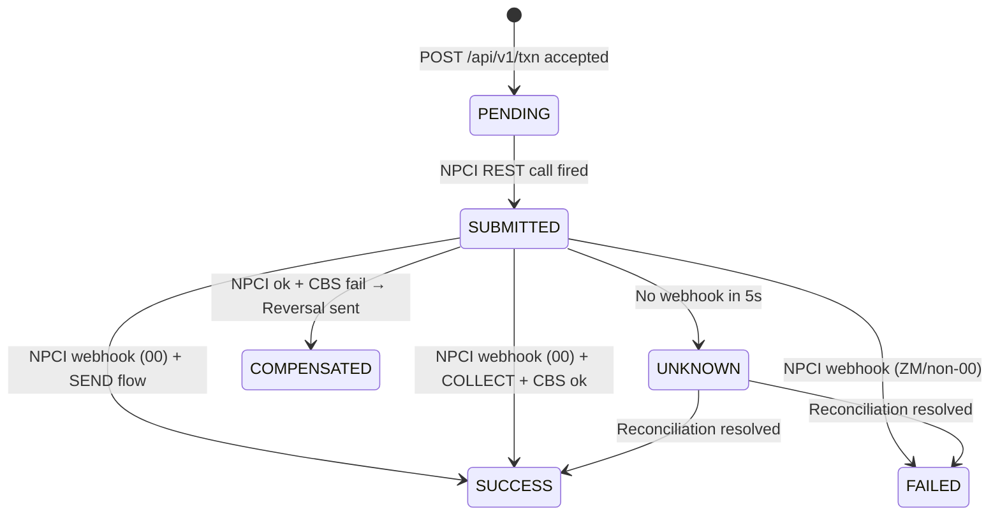

# Response Codes & States Reference

Complete reference of all HTTP status codes, transaction states, NPCI response codes, and API endpoints exposed by the PSP Orchestrator.

---

## Transaction States Lifecycle



---

## Transaction States

| State | HTTP at query | Meaning | Ledger Written? |
|-------|--------------|---------|----------------|
| `PENDING` | `202` | Transaction accepted, awaiting NPCI | No |
| `SUBMITTED` | `202` | Forwarded to NPCI, awaiting webhook | No |
| `SUCCESS` | `200` | Fully settled | Yes |
| `FAILED` | `200` | NPCI rejected or validation failed | No |
| `UNKNOWN` | `200` | NPCI timed out, queued for reconciliation | No |
| `COMPENSATED` | `200` | COLLECT: CBS failed, NPCI reversal sent | No |

---

## HTTP Response Codes

| Code | When | Meaning |
|------|------|---------|
| `202 Accepted` | New transaction accepted | Saga started, poll for final state |
| `200 OK` | Idempotent replay | Cached response returned, `X-Idempotent-Replayed: true` header set |
| `400 Bad Request` | Validation failure | `state=FAILED`, `failureReason` populated |
| `404 Not Found` | `GET /txn/{unknown_id}` | Transaction not found |

---

## NPCI Response Codes

| Code | Meaning | Our Response |
|------|---------|-------------|
| `00` | Success / Approved | Proceed to SEND or COLLECT completion |
| `ZM` | Transaction Declined | `state=FAILED` |
| `Z9` | Remitter Bank Offline | `state=FAILED` |
| `Z8` | Beneficiary Bank Offline | `state=FAILED` |
| `XH` | Account Blocked | `state=FAILED` |
| `AM` | Amount Limit Exceeded | `state=FAILED` |

---

## Control API Endpoints

| Method | Endpoint | Purpose |
|--------|----------|---------|
| `POST` | `/api/v1/control/npci-failure?enabled=true` | Force NPCI to reject all transactions |
| `POST` | `/api/v1/control/npci-timeout?enabled=true` | Suppress NPCI webhook → triggers UNKNOWN |
| `POST` | `/api/v1/control/cbs-failure?enabled=true` | Force CBS credit failure → triggers COMPENSATED |
| `POST` | `/api/v1/control/kafka-publish-test` | Publish test event to Kafka |
| `GET` | `/api/v1/control/reconcile-now` | Manually trigger reconciliation sweep |
| `GET` | `/api/v1/control/status` | Show all toggle states + transaction counts |

---

## Transaction API Endpoints

| Method | Endpoint | Purpose |
|--------|----------|---------|
| `POST` | `/api/v1/txn` | Initiate a new UPI transaction (SEND or COLLECT) |
| `GET` | `/api/v1/txn/{txnId}` | Poll final transaction state |

---

## Request Payload Reference

```json
{
  "tr":   "ORD-001",             // Transaction Reference (idempotency key part 1)
  "pa":   "merchant@yesbank",    // Payee UPI ID (idempotency key part 2)
  "pn":   "Fresh Mart",          // Payee Name
  "mc":   "5411",                // Merchant Category Code (0000 = P2P)
  "am":   500.00,                // Amount (INR)
  "mam":  100.00,                // Minimum Amount
  "cu":   "INR",                 // Currency (only INR supported)
  "mode": "16",                  // UPI Payment Mode (04/05/16)
  "mid":  "MID-001",             // Merchant ID (required for mode 16)
  "msid": "STORE-01",            // Store ID (required for mode 16)
  "mtid": "POS-01",              // Terminal ID (required for mode 16)
  "isSignatureVerified": true,   // TPAP signature validity
  "flowDirection": "SEND"        // "SEND" (Payer PSP) or "COLLECT" (Receiver PSP)
}
```

---

## Idempotency Key Structure

```
idempotency_key = tr + "::" + pa

Example: "ORD-001::merchant@yesbank"
```

The composite key ensures that the same transaction reference from the same payee is de-duplicated globally across Redis — even across microservice restarts.
