# SEND Flow (Payer-Side) Tests

The **SEND flow** is triggered when a customer initiates a payment from their TPAP (e.g., PhonePe, GPay). The money leaves the payer's account at their PSP and arrives at the payee's PSP. Our Orchestrator acts as the **Payer-Side PSP Switch** — it forwards to NPCI and audits the result. **No CBS interaction is required.**

```mermaid
sequenceDiagram
    autonumber
    
    actor TPAP as UPI App (TPAP)
    participant Orch as Orchestrator
    participant StateDB as Transaction State DB
    participant NPCI as NPCI Switch
    participant Ledger as Financial Ledger (CBS)

    %% Ingestion & Validations
    rect rgb(20, 40, 60)
    note right of TPAP: [test06 & test12] Validates Mode (04 P2P, PIN required)
    TPAP->>Orch: POST /txn (UPI Send Request)
    note right of Orch: [test02] Idempotency checks block 2nd requests here
    Orch->>StateDB: Lock Idempotency & Save PENDING
    Orch-->>TPAP: HTTP 202 Accepted
    end

    %% Async Forwarding
    rect rgb(60, 20, 60)
    note right of Orch: [test10] 5-second Watchdog starts here (UNKNOWN Timeout)
    Orch-)+NPCI: HTTP POST /upi/reqPay
    NPCI-->>Orch: HTTP 200 OK (Acknowledged)
    Orch->>StateDB: Update State to SUBMITTED
    end
    
    %% NPCI Webhook & Completion
    rect rgb(20, 60, 40)
    note right of NPCI: [test04] NPCI can fire Rejection Webhook (responseCode=ZM)
    NPCI->>Orch: HTTP POST /webhook/npci
    note right of Orch: [test01] Happy Path concludes here with SUCCESS
    Orch->>StateDB: Update final state (SUCCESS/FAILED/etc)
    Orch->>Ledger: Write Audit Trail (ONLY on SUCCESS)
    Orch-->>TPAP: Notify App (Txn Complete)
    end
```



---

## test01 — Happy Path

**What it proves:** A normal SEND transaction completes end-to-end and writes to the ledger.

```java
MvcResult result = mockMvc.perform(post("/api/v1/txn")
    .content(objectMapper.writeValueAsString(validRequest("ORD-HP-001"))))
    .andExpect(status().isAccepted())          // HTTP 202
    .andExpect(jsonPath("$.state").value("PENDING"))
    .andReturn();

awaitState(txnId, "SUCCESS");                  // Async final state
assertTrue(ledgerService.hasEntry(txnId));     // Audit was written
assertNotNull(resp.getApprovalRefNo());        // ARN present
assertTrue(resp.getApprovalRefNo().startsWith("ARN-"));
```

**Response:** `state=SUCCESS`, `approvalRefNo=ARN-XXXXXX`, `responseCode=00`

---

## test02 — Duplicate Request (Idempotency Replay)

**What it proves:** Sending the exact same payload twice never double-charges the customer. The second request returns the original `txnId` with `HTTP 200 OK`.

```java
// First request → 202 PENDING → resolves to SUCCESS
// Second request with same tr + pa:
mockMvc.perform(post("/api/v1/txn").content(samePayload))
    .andExpect(status().isOk())                          // HTTP 200 (not 202!)
    .andExpect(header().string("X-Idempotent-Replayed", "true"))
    .andExpect(jsonPath("$.txnId").value(originalTxnId));// Same txnId echoed back
```

**Why `200 OK` not `FAILED`?** If a merchant's Wi-Fi drops after a successful payment, their app will auto-retry. Returning `FAILED` would cause the cashier to ask the customer to pay again — resulting in a **double charge**. Returning the cached `SUCCESS` receipt prevents that entirely.

---

## test04 — NPCI Failure

**What it proves:** When NPCI rejects the transaction (wrong PIN, blocked account, insufficient funds), the Orchestrator correctly cleans the state and does NOT write to the ledger.

```java
npciAdapter.setFailureMode(true);  // NPCI returns responseCode="ZM"

awaitState(txnId, "FAILED");
assertFalse(ledgerService.hasEntry(txnId));  // No ledger write on failure
```

**What `responseCode="ZM"` means in UPI?** It is NPCI's reject code for "Transaction Declined / No Such Issuer".

---

## test06 — Mode 04: UPI PIN Required

**What it proves:** Payment mode `04` (standard UPI P2M) sets the `requiresPasscode=true` flag, signalling the TPAP to show the UPI PIN entry screen.

```java
req.put("mode", "04");
mockMvc.perform(post("/api/v1/txn").content(req))
    .andExpect(status().isAccepted())
    .andExpect(jsonPath("$.requiresPasscode").value(true));
```

---

## test07 — Mode 05: Tap & Pay (No PIN)

**What it proves:** Payment mode `05` (NFC/Tap & Pay) is below the UPI mandated PIN-free limit. `requiresPasscode=false`, allowing immediate debit without user interaction.

---

## test09 — Retry After SUCCESS

**What it proves:** Even after the transaction is fully settled and in `SUCCESS` state, retrying the same request returns the same result — no new txnId is generated.

```java
awaitState(txnId, "SUCCESS");
// Retry:
mockMvc.perform(post("/api/v1/txn").content(samePayload))
    .andExpect(jsonPath("$.state").value("SUCCESS"))
    .andExpect(jsonPath("$.txnId").value(originalTxnId));
```

---

## test10 — Timeout → UNKNOWN

**What it proves:** If NPCI goes completely silent and never fires a webhook (network partition, NPCI node crash), the 5-second timeout guard kicks in and marks the transaction `UNKNOWN`. This prevents the transaction from being stuck in `SUBMITTED` forever and queues it for reconciliation.

```java
npciAdapter.setSuppressWebhook(true);   // NPCI deliberately silent

awaitState(txnId, "UNKNOWN");  // Timeout fires after 5s
```

---

## test12 — P2P Flow Detected

**What it proves:** When `mc=0000` (Merchant Category Code for peer-to-peer), the system detects it is a P2P transfer and brands the response with `flowType=P2P` instead of `MERCHANT`.

```java
req.put("mc", "0000");
mockMvc.perform(post("/api/v1/txn").content(req))
    .andExpect(jsonPath("$.flowType").value("P2P"));
```
